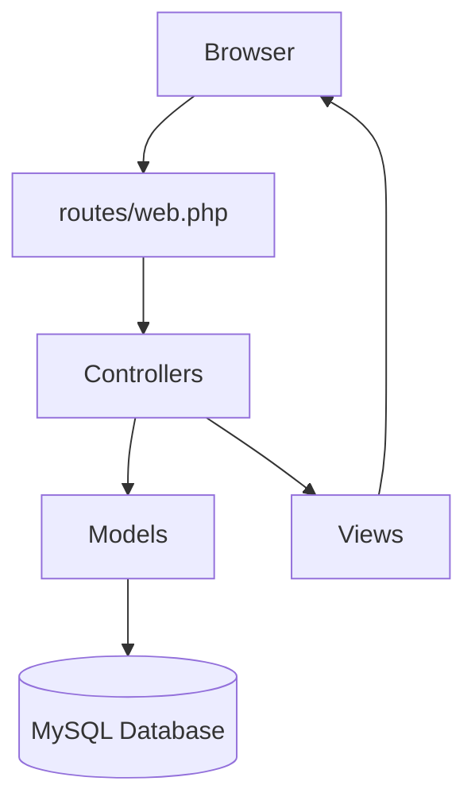
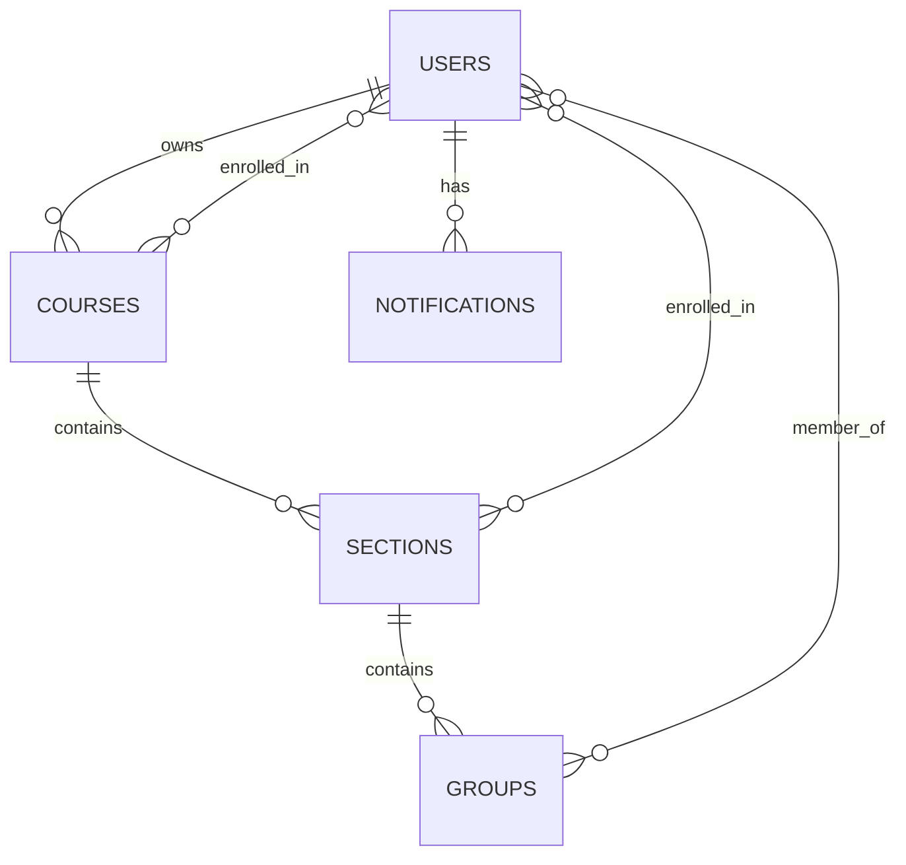

# GroupHup — System Documentation

**Jadara University | Department of Software Engineering**  
**Course:** Software Development & Documentation  
**Supervisor:** Dr. Zahi Abusarhan  
**Semester:** 2025/2026

---

## 1. Project Overview

### 1.1 Description

GroupHup is a web-based team formation system built with **Laravel 11** for Jadara University. It replaces manual group management with an automated, role-based platform that supports three distinct group formation methods: **Manual**, **Student Choice**, and **Random**.

### 1.2 Problem Statement

Instructors at Jadara University often manage student groups manually using spreadsheets, email threads, and verbal coordination. Students also lack a centralized system to view group assignments or communicate with teammates. GroupHup solves this problem by providing one unified platform for all group-related operations.

### 1.3 Objectives

- Provide role-based access for instructors and students.
- Support three group formation strategies to fit different course needs.
- Allow bulk student enrollment through CSV upload.
- Send in-system notifications for group membership changes.
- Integrate with Microsoft Teams via clickable email links.
- Deliver a clean, responsive dark-themed interface.

### 1.4 Scope

| In Scope | Out of Scope |
|---|---|
| Course and section management | Email/SMS notifications |
| Group formation with 3 methods | File sharing between group members |
| CSV student enrollment | Video conferencing |
| In-system notifications | Grade management |
| Microsoft Teams link generation | Mobile native app |
| Instructor member management | Advanced analytics |
| Report generation | |

---

## 2. System Requirements

### 2.1 Functional Requirements

#### Instructor
- Register and authenticate using a university ID.
- Create courses with configurable min/max group size.
- Create sections and assign a formation method per section.
- Upload students via CSV or add them individually by student ID.
- Generate random groups, locked after the first generation.
- Create groups manually in any section type.
- Add or remove students from any group.
- View group members with Teams email links.
- Download a sample CSV template.
- View and mark notifications as read.

#### Student
- Register and authenticate using a university ID.
- View enrolled courses and sections.
- Create a group in Student Choice sections.
- Join an available group in Student Choice sections.
- Leave a group in Student Choice sections.
- View group members and their Teams emails.
- View and mark notifications as read.

### 2.2 Non-Functional Requirements

| Category | Requirement |
|---|---|
| Security | CSRF protection on all forms, session-based auth, and role checks on every route. |
| Usability | Consistent dark UI, confirm modals before destructive actions, and flash messages for feedback. |
| Performance | Eager loading with `with()` to prevent N+1 queries. |
| Reliability | Server-side validation on all inputs and graceful error handling. |
| Maintainability | MVC architecture and single-responsibility controllers. |

### 2.3 Technical Requirements

| Component | Technology | Version |
|---|---|---|
| Backend Framework | Laravel | 11.x |
| Language | PHP | 8.2+ |
| Database | MySQL | 8.0+ |
| Frontend | Blade + Custom CSS | — |
| Local Server | XAMPP | 8.x |
| Authentication | Laravel Session Auth | — |
| Icons | Font Awesome | 4.7 |
| Fonts | Inter, Space Grotesk | — |

---

## 3. System Design

### 3.1 Architecture — MVC Pattern



The system follows Laravel’s MVC architecture. The browser sends a request, routes map it to the proper controller, controllers process business logic, models handle data access, and views render the final interface. Laravel’s routing and controller structure are designed to keep applications organized and maintainable [web:32][web:31].

### 3.2 Main Application Layers

- **Routes** map URLs to controller methods.
- **Controllers** handle requests and application logic.
- **Models** define relationships and database access.
- **Views** provide the Blade user interface for instructors and students.

### 3.3 Group Formation Methods

| Method | Created By | Members Assigned By | Locked? |
|---|---|---|---|
| Manual | Instructor | Instructor manually adds members | No |
| Student Choice | Student or Instructor | Students join freely | No |
| Random | System automatically | Algorithm assigns members | Yes, after first run |

### 3.4 Random Group Algorithm

1. Fetch all enrolled students in the section.
2. Shuffle the student list randomly.
3. Divide the list into chunks of `group_size`.
4. If the last chunk contains fewer than 2 students, merge it with the previous group.
5. Create group records and attach members.
6. Set `section.random_locked = true`.

### 3.5 Notification Triggers

| Event | Who Gets Notified |
|---|---|
| Student creates a group | The student |
| Student joins a group | The student |
| Instructor adds a student to a group | The student added |

---

## 4. Database Design

### 4.1 Entity Relationship Overview



The database structure is built around users, courses, sections, groups, and notifications. Many-to-many relationships are used for enrollment and group membership, which is a standard Eloquent design for flexible data modeling [web:31][web:33].

### 4.2 Tables

#### users

| Column | Type | Description |
|---|---|---|
| id | BIGINT PK | Auto-increment |
| name | VARCHAR | Full name |
| student_id | VARCHAR UNIQUE | Used for login |
| role | ENUM | `student` or `instructor` |
| teams_email | VARCHAR NULL | Auto-generated |
| password | VARCHAR | Bcrypt hashed |
| timestamps | — | created_at, updated_at |

#### courses

| Column | Type | Description |
|---|---|---|
| id | BIGINT PK | Auto-increment |
| name | VARCHAR | Course name |
| min_students | INT | Minimum group size |
| max_students | INT | Maximum group size |
| user_id | FK → users | Owning instructor |
| timestamps | — | — |

#### sections

| Column | Type | Description |
|---|---|---|
| id | BIGINT PK | Auto-increment |
| course_id | FK → courses | Parent course |
| name | VARCHAR | Section label |
| formation_method | ENUM | `manual`, `student_choice`, `random` |
| group_size | INT | Target group size |
| random_locked | BOOLEAN | Prevents re-generation |
| timestamps | — | — |

#### groups

| Column | Type | Description |
|---|---|---|
| id | BIGINT PK | Auto-increment |
| name | VARCHAR | Group name |
| section_id | FK → sections | Parent section |
| created_by | FK → users | Creator |
| is_random | BOOLEAN | Was auto-generated |
| timestamps | — | — |

#### notifications

| Column | Type | Description |
|---|---|---|
| id | BIGINT PK | Auto-increment |
| user_id | FK → users | Recipient |
| title | VARCHAR | Short title |
| message | TEXT | Full message |
| type | VARCHAR | Example: `group` |
| read_at | TIMESTAMP NULL | Null means unread |
| timestamps | — | — |

### 4.3 Pivot Tables

| Table | Columns | Purpose |
|---|---|---|
| course_user | course_id, user_id | Students enrolled in courses |
| section_user | section_id, user_id | Students enrolled in sections |
| group_user | group_id, user_id | Students in groups |

---

## 5. Implementation Details

### 5.1 Authentication

The system uses Laravel session authentication with a custom login field. Instead of the default email field, users log in using `student_id`.

```php
Auth::attempt([
    'student_id' => $request->student_id,
    'password' => $request->password
]);
```

After successful login, the user is redirected according to their role. Laravel’s built-in authentication flow supports this type of custom login configuration through standard request handling and model behavior [web:29][web:32].

### 5.2 CSV Upload

#### Upload Flow
1. Instructor uploads a CSV file.
2. The system reads each row and skips the header.
3. For each `student_id`:
   - Find the user with that ID and `role = student`.
   - Check that the student is not already in another section of the same course.
   - Attach the student to the `section_user` and `course_user` pivot tables.
4. Return the number of rows added and skipped.

### 5.3 Teams Email Generation

Teams email addresses are generated for quick contact links.

```php
// For students:
$teamsEmail = $student->student_id . '@std.jadara.edu.jo';

// For instructors:
$teamsEmail = $instructor->student_id . '@doc.jadara.edu.jo';
```

These addresses are shown as clickable links so users can open Microsoft Teams conversations directly.

### 5.4 Security Implementation

| Measure | How |
|---|---|
| CSRF Protection | `@csrf` directive on every form |
| Role Authorization | `if (auth()->user()->role !== 'instructor')` checks |
| Ownership Verification | `if ($course->user_id !== auth()->id())` checks |
| Input Validation | `$request->validate([...])` before database operations |
| Password Security | `Hash::make($request->password)` on registration |

### 5.5 Controllers Overview

| Controller | Responsibility |
|---|---|
| AuthController | Login, register, logout |
| DashboardController | All dashboard and notification views |
| CourseController | Create and delete courses |
| SectionController | Create sections, upload CSV, add students, generate random groups |
| GroupController | Create, join, leave, delete groups; add/remove members |

---

## 6. User Guide

### 6.1 Instructor

#### Creating a Course
1. Go to **My Courses** from the sidebar.
2. Fill in:
   - Course Name.
   - Min per Group.
   - Max per Group.
3. Click **Create Course**.

#### Adding a Section
1. Click **Manage** on any course.
2. Fill in:
   - Section Name.
   - Formation Method.
   - Group Size.
3. Click **Add Section**.

#### Enrolling Students
- **By ID:** Enter the student's university ID and click **Add**.
- **By CSV:** Download the sample template, fill it, and upload it.

#### Managing Groups
- **Manual:** Click **Create Group**, enter a name, and add members by ID.
- **Random:** Click **Generate Random Groups** before the first generation.
- **Student Choice:** Students manage themselves, but the instructor can override if needed.
- Click **Group Details** to view members, add members, or remove them.

#### Removing a Member
1. Open **Group Details**.
2. Click **Remove** next to the student's name.
3. Confirm the action in the dialog.

### 6.2 Student

#### Viewing Your Groups
1. Login.
2. Go to **My Groups** from the sidebar.
3. View all sections and your group status in each section.

#### Creating a Group
This works only in **Student Choice** sections.

1. Find a section with `Student Choice` method.
2. Click **Create Group**.
3. Enter a group name.
4. Confirm.

#### Joining a Group
This works only in **Student Choice** sections.

1. Browse available groups in the section.
2. Click **Join**.
3. Confirm in the dialog.

#### Leaving a Group
1. Find your current group.
2. Click **Leave Group**.
3. Confirm.

**Note:** Students cannot leave **Manual** or **Random** groups.

---

## 7. API Routes Reference

### 7.1 Public Routes

| Method | URL | Action |
|---|---|---|
| GET | `/` | Redirect to login |
| GET | `/login` | Show login page |
| POST | `/login` | Authenticate |
| GET | `/register` | Show register page |
| POST | `/register` | Create user |

### 7.2 Instructor Routes

| Method | URL | Action |
|---|---|---|
| GET | `/instructor` | Dashboard |
| GET | `/instructor/courses` | List courses |
| GET | `/instructor/courses/{id}` | Course details |
| GET | `/instructor/notifications` | Notifications |
| POST | `/courses` | Create course |
| DELETE | `/courses/{id}` | Delete course |
| POST | `/courses/{id}/sections` | Create section |
| POST | `/sections/{id}/upload-students` | CSV upload |
| POST | `/sections/{id}/add-student` | Add by ID |
| POST | `/sections/{id}/groups` | Create group |
| POST | `/sections/{id}/generate-groups` | Random generate |
| POST | `/groups/{id}/add-member` | Add member |
| DELETE | `/groups/{id}/members/{uid}` | Remove member |
| DELETE | `/groups/{id}` | Delete group |

### 7.3 Student Routes

| Method | URL | Action |
|---|---|---|
| GET | `/student` | Dashboard |
| GET | `/student/courses` | My courses |
| GET | `/student/groups` | My groups |
| GET | `/student/notifications` | Notifications |
| POST | `/groups/student-create` | Create group |
| POST | `/groups/{id}/join` | Join group |
| POST | `/groups/{id}/leave` | Leave group |
| POST | `/notifications/{id}/mark-read` | Mark as read |

### 7.4 Route Design Notes

Laravel route groups and middleware are commonly used to share protection and role-specific behavior across many routes. This makes the application easier to maintain and keeps access control consistent [web:32][web:34].

---

## 8. References

### 8.1 Official Documentation
- [Laravel 11 Documentation](https://laravel.com/docs/11.x) — Official Laravel framework reference.
- [PHP 8.2 Documentation](https://www.php.net/docs.php) — PHP language reference.
- [MySQL 8.0 Reference Manual](https://dev.mysql.com/doc/) — Database management reference.

### 8.2 Learning Tutorials
- Laravel Tutorial (Arabic) — Mohamed Qatish.
- Laravel Advanced Tutorial (Arabic) — Atef Soft.

### 8.3 Articles and Guides
- [GitHub README Documentation Guidelines](https://docs.github.com/en/repositories/managing-your-repositorys-settings-and-features/customizing-your-repository/about-readme-files) — Explains how READMEs are used to describe projects and help users.
- [Laravel Routing Documentation](https://laravel.com/docs/11.x/routing) — Official routing reference for Laravel 11 [web:32].
- [Laravel Eloquent Relationships](https://laravel.com/docs/11.x/eloquent-relationships) — Official relationship documentation [web:31].
- [Laravel Brain — Medium Article](https://medium.com/@developerawam/laravel-brain-the-fastest-way-to-understand-a-laravel-codebase-you-didnt-write-af286c944439) — Guide to understanding Laravel project structure quickly.


### 8.4 Tools
- [XAMPP](https://www.apachefriends.org/) — Local development environment.

---

## Final Note

GroupHup was built for academic use at Jadara University and demonstrates how Laravel can be used to create a structured, role-based system for managing student groups efficiently.

**GroupHup — Jadara University | Software Engineering Department | 2025–2026**  
**Supervised by Dr. Zahi Abusarhan**
